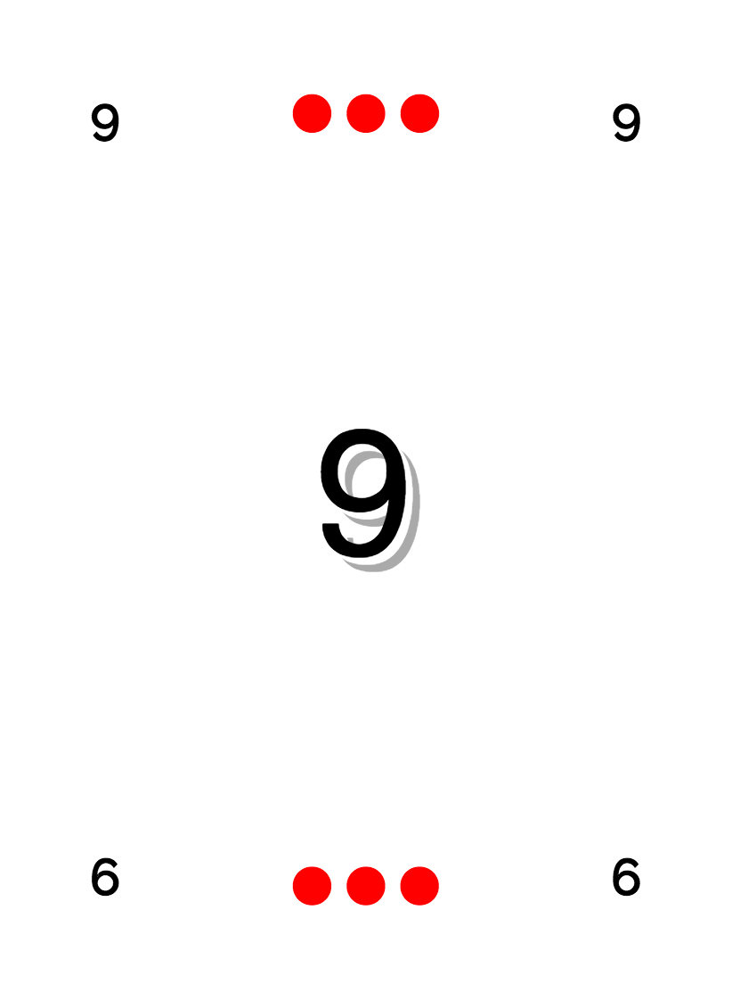
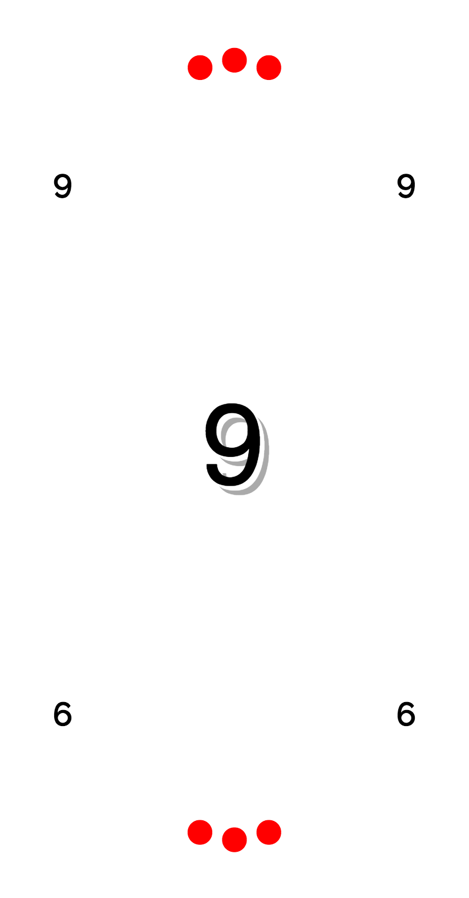
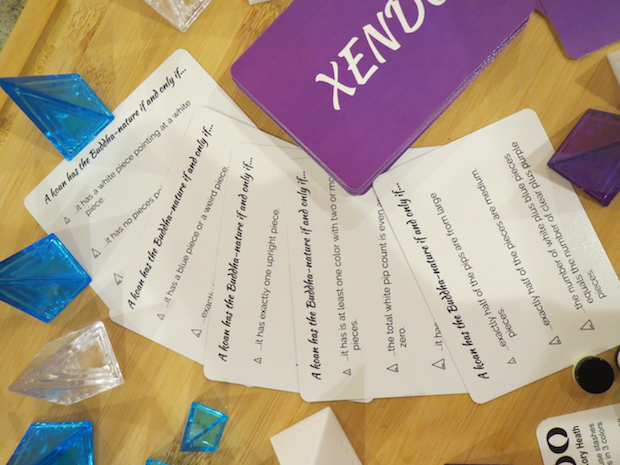
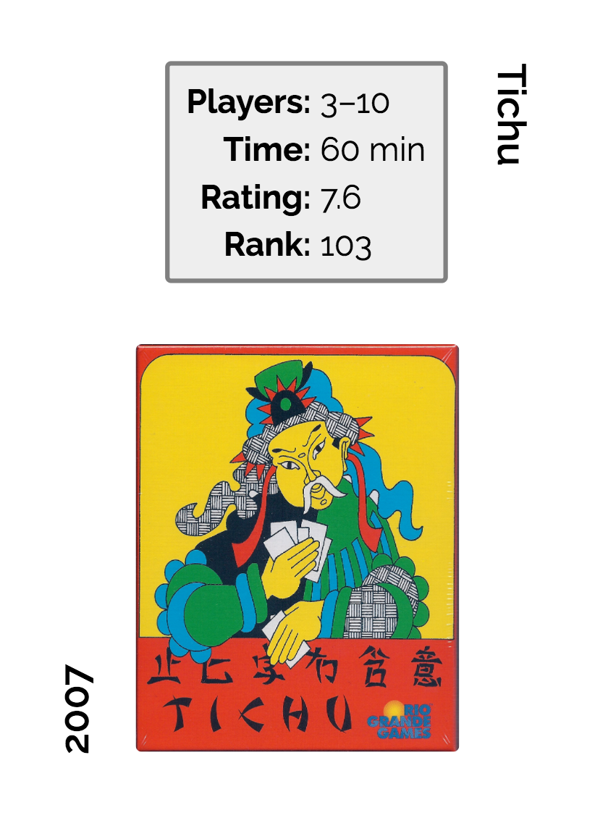
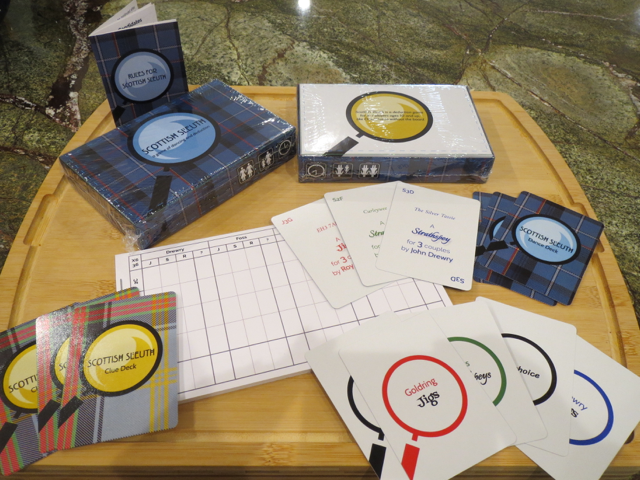

# CardPen Examples

## Pico

The Pico example is the base example; it also has an oval variant.  Pico demonstrates how to make a basic, numerical card set in CardPen, with some additional information encoded as pips.  The oval variant is more fun than educational.

 

### Notes

Pico is an out-of-print mini game by Doris & Frank.  I picked it for the basic CardPen example because it has only 11 (very simple) cards.  Note that there is a rebalanced sequel, Pico 2; if you need English rules for Pico, they can be inferred from the rules for Pico 2.

* [Publisher site](http://doris-frank.de/GamesPico.html)
* BoardGameGeek entries: [Pico](https://boardgamegeek.com/boardgame/2051/pico), [Pico 2](https://boardgamegeek.com/boardgame/606/pico-2)

## Xendo

Xendo is an example of cards using the **Rowsets** functionality (in sets of 3), where you can use more than one line from your "card" list on each card, as well as the `{{@index}}` tag to add a different bullet-type image next to each line.  The example uses the **cycle** setting for **Rowsets** in order to get three rules of increasing difficulty onto the cards.  The **random** setting for **Rowsets** would have made the difficulty unpredictable, while the **bunch** setting would have grouped rules of similar difficulty on each card.

There's also a separate, simple Xendo card back example (which uses an empty cardlist).

The pictured cards were printed at ArtsCow; it's not clear from the photo, but the originally solid purple background came out with a bit of a line across it that could matter if the cards were for a normal card game (but doesn't matter at all in Zendo).

### Notes

Zendo is an induction game where the other players try to guess the "rule" chosen by the "master", and Zendo rule cards list possible "rules" for novice players.  The original, long out-of-print edition of Zendo came with rule cards, and they were also sold separately by Looney Labs (until those also went out of print).  Xendo is a set of Zendo rule cards for use with Xeno pyramids instead of the traditional Rainbow pyramids.

Although Zendo is out of print, it is easily [reassembled](https://boardgamegeek.com/image/3611977/zendo) out of still-in-print [Looney pyramids](http://www.looneylabs.com/looney-pyramids) and other bits.  Likewise, people have recreated Zendo rule cards, but those usually mention the Rainbow colors so I made this set with Xeno colors.

Xendo is unrelated to a proposed science retheme of Zendo also called [Xendo](http://new.wunderland.com/2013/06/13/introducing-xendo/), which has apparently fallen by the wayside in favor of a planned shape retheme known only as [Zendo 2.0](https://youtu.be/mstV9dc6swA).

### Credits

* [BoardGameGeek entry](https://boardgamegeek.com/boardgame/6830/zendo)
* I have an old Zendo rules card (as opposed to the Zendo rule cards); rules are also available from publisher Looney Labs ([HTML](http://www.looneylabs.com/rules/zendo) or [IceSheet (PDF)](http://www.looneylabs.com/sites/default/files/rules/Zendo.pdf), and from the devisor, [Kory Heath](http://www.koryheath.com/zendo/)

The rule list I used for the cards is derived from [Jacob Davenport's](http://www.playagaingames.com/games/zendo_some_rules/) list of Zendo rules ordered by difficulty.  I switched the colors before turning the list into a "card" list.  The pyramid images used for bullet points are from [Lou Lessing's Pyramid Arcade Font](http://www.looneylabs.com/other-pyramid-games). 

## BGG

The BGG examples show how to use the BoardGameGeek API functionality within CardPen to make cards out of your BGG collection.

There are two examples: one with the images hosted locally at CardPen, and one that uses the remote images at BGG.  The non-local example also includes some tweaking necessary when retrieving images from a site that does not have CORS configured correctly; the tweaks use the `{{cardImage}}` tag and a CORS proxy server.

* BGG entry for [I don't know, what do you want to play?](https://boardgamegeek.com/boardgame/28567/i-dont-know-what-do-you-want-play)

## Scottish Sleuth

Scottish Sleuth is a collection of pieces of a rethemed game I published privately, mostly through [The Game Crafter](https://www.thegamecrafter.com/publish/products) though I printed the prototype cards through ArtsCow.  This example shows more complicated (but still mostly text-based) cards and backs, how to make a box using overlays, various sizes of scorepad (requiring rotation), and a set of rules.

### Cards and Backs

The Scottish Sleuth card backs use two background images, one for the plaid (on the *card* element) and one for the magnifying glass (on the *bleed* element).
The Clue Deck faces are similar, but without the plaid background, while the Dance Deck faces are simpler text, laid out something like the Pico example cards.

Note that the logic of the Clue Deck is more complicated than that of the Dance Deck; the Clue Deck card list has many blank fields,
and it uses Mustache instead of Handlebars for its template.

### Box

The box is an example of a Small Pro Box from The Game Crafter, and uses their overlays.  Note that I put both boxes into the same project, which means you need to switch overlays manually to get the correct one.  Most of the box uses the same graphics as the rest of the game, just laid out in different sizes, except for the player/age/time icons.  I made SVGs for those in another program (mostly Boxy with some hand editing), and the text on them came out a bit too small in the prototype print run (pictured above).

Note that there are registration (overlay) marks on the prototype boxes that were made with a beta version of CardPen; the current version doesn't support leaving the overlay on any generated images, though you can do it with HTML.

### Scorepads

There's a variety of scorepad examples for several reasons.  I made them in color at first thinking I'd print them at ArtsCow, but then switched to The Game Crafter which only supports black and white.  I printed different sizes:  small to fit in the Small Pro Box and a medium pad for playtesting.  I also printed different text: the standard Sleuth layout (adapted to my retheme), and a cleverer layout that I [found at BGG](https://boardgamegeek.com/image/184197/sleuth).  Because The Game Crafter allows different fronts and backs on scorepads, I was able to combine both options on one pad.  I only did so on the smaller pads, where it seemed that the extra space of the simpler layout would be more useful.

None of the scorepads converted to images well, probably because it's a big table.  They all bled into the bleed section once converted to 300 DPI images, though they had looked fine as HTML.  In other examples where such problems arose I figured out the issue (generally web fonts or CSS units) and fixed it, but in this case I used the `.cardImage` built-in class as part of my styles in order to hack the thing down to the right size by eyeballing the difference.

### Rules

CardPen is not intended for making rulebooks, but I needed one so I made one with it anyway.
I started by writing the rules in Markdown.  Once they seemed ready, I converted them to HTML,
then put them into a card list to eyeball them.
(Note that putting HTML into a card list requires the triple-brace tag syntax to parse the HTML:
`{{{Text}}}` is the tag used in my final rules template.)

I had a few choices of rulebook (booklet) sizes from The Game Crafter,
but it's more economical if you end up with multiples of four pages
so I picked the size that seemed most likely to do so.  After that, I did a lot of tweaking of the rules
to get them to come out in page-sized chunks that I thought would be easier to understand.
I tweaked directly in the `json` (export) file and reloaded it each time to see how things were going.
For an easier time of it, I would recommend tweaking a CSV file and reloading that,
and possibly using the rowsets functionality to break it down into more manageable chunks.

### Credits

* BGG entry for [Sleuth](https://boardgamegeek.com/boardgame/594/sleuth)

The magnifying glass is an SVG originally from [Game-icons.net](http://game-icons.net);
I edited it manually.
I also made the player count/age/time icons on the box,
partly manually and partly in [Boxy SVG](https://boxy-svg.com), an SVG editor for the Mac.
The main tartan (darker blue) is registered to the RSCDS;
the alternate (lighter blue) tartan is Bell of the Borders.
Dances were collected from [the Scottish Country Dance Database](https://my.strathspey.org/dd/index/).

## Micropul

I'm making a version of Micropul using Small Square Tile chits from The Game Crafter.  Once again I can't publish my work because Micropul is for personal use only, but you can do the same thing yourself.

I took a Micropul tile image from the Files section at BGG, converted it to PNG (it was a PDF), and used [ImageMagick](http://imagemagick.org/Usage/crop/#crop_spaced) to trim and slice it, then trim the remaining cut lines off the result (and extend or scale down):

`convert -density 300 micropul.pdf micropul.png`  
`convert -crop 2250x3000+151+121 micropul.png micropul-cropped.png`  
`convert micropul-cropped.png -crop 6x8-0-0@ +repage +adjoin tile-%d.png`  
`convert tile-*.png -shave 1x1 tile_shaved-%d.png`
`convert tile_shaved*.png -background none -gravity center -extent 450x450 tile_shaved_resized-%d.png`

or:

`convert -density 600 micropul.pdf micropul.png`  
`convert -crop 4500x6000+301+241 micropul.png micropul-cropped.png`  
`convert micropul-cropped.png -crop 6x8-0-0@ +repage +adjoin tile-%d.png`    
`convert tile-*.png -shave 2x2 tile_shaved-%d.png`
`convert tile_shaved-*.png -resize 450x450 tile_shaved_resized-%d.png`

There's a back at BGG that I also used:

`convert -density 600 micropulback.pdf micropulback.png`  
`convert -crop 750x750+10+10 micropulback.png micropulback-cropped.png`  
`convert micropulback-cropped.png -resize 450x450 micropulback-cropped-resized.png`

`convert -crop 450x450+10+10 micropulback.png micropulback-start.png`  

### Credits

* The [Micropul](http://neutralbox.com/micropul/) page
* Micropul [BGG entry](https://boardgamegeek.com/boardgame/10660/micropul)
* The BGG [files section](https://boardgamegeek.com/boardgame/10660/micropul/files) includes [the high-res version](https://boardgamegeek.com/filepage/127102/high-res-version-original-pnp) of the original PnP game that I used, along with many nice rethemes, including [Carthagnian's redesigns](https://boardgamegeek.com/filepage/34338/carthaginians-redesigns-micropul), most of which can also be sliced up the same way.  (I didn't use them because of bleed concerns.)

